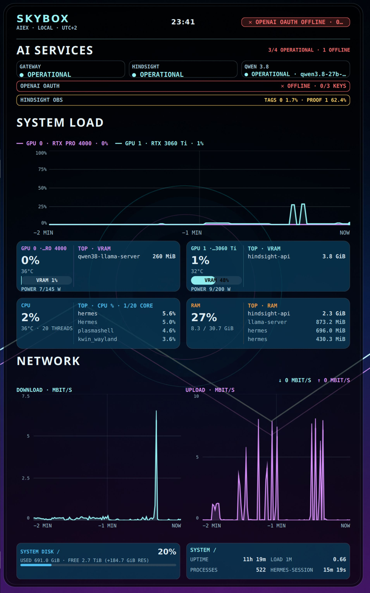

# Skybox Live Monitor



A compact, vertical real-time system dashboard for **KDE Plasma 6**. It is designed for a dedicated status display and shows CPU, GPU, VRAM, RAM, network throughput, disk space, and the most relevant active processes.

## Highlights

- CPU temperature display (like GPU card — no percentage, no progress bar)
- GPU utilization and VRAM telemetry with top GPU processes
- Compact CPU and RAM process summaries
- Two-minute CPU/GPU and network history charts
- NVIDIA VRAM telemetry via `nvidia-smi`
- Local Qwen 3.8 service health via localhost only
- Longest Hermes run across the default and named profiles
- No telemetry, no external network requests, and no credentials

## Requirements

- KDE Plasma 6 (Wayland or X11)
- NVIDIA GPU and `nvidia-smi` for GPU/VRAM metrics (other panels still work without it)

## Install

```bash
kpackagetool6 --type Plasma/Applet --install .
```

To update an existing installation:

```bash
kpackagetool6 --type Plasma/Applet --upgrade .
```

Then add **Skybox Vertical System Dashboard** from Plasma's *Add Widgets* dialog.

For a development refresh:

```bash
rm -rf ~/.cache/qmlcache
systemctl --user restart plasma-plasmashell.service
```

## Tests

```bash
python3 tests/test_dashboard_source.py
python3 tests/test_monitor_behavior.py
python3 tests/test_hermes_think_time.py
node --check contents/code/monitor_logic.js
qmllint contents/ui/main.qml
```

The Python behavior suite executes the network-detection command in an isolated temporary environment. `qmllint` may report unresolved Plasma types when run outside Plasma's import environment; run the widget inside Plasma as the final integration check.

## License

MIT. See [LICENSE](LICENSE).