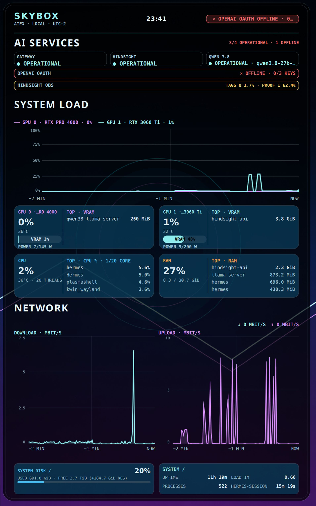

# Skybox Live Monitor



A compact, vertical real-time system dashboard for **KDE Plasma 6**. It is designed for a dedicated status display and shows CPU, GPU, VRAM, RAM, network throughput, disk space, and the most relevant active processes.

## Highlights

- CPU temperature display (like GPU card — no percentage, no progress bar)
- CPU and RAM cards label their thread count, so a per-process 52% next to an
  aggregate 4% CPU reading is unambiguous
- Independent telemetry for every NVIDIA GPU (0, 1, 2): utilization, temperature,
  VRAM, power and per-GPU compute processes (up to four largest consumers). The
  three GPU cards sit side by side in one row; CPU and RAM share the row below
- Compact CPU and RAM process summaries (up to four largest consumers)
- Two-minute multi-GPU and network history charts, with one shared unit per
  network panel so axis and live value always agree
- Disk usage in `df` semantics, including the filesystem reserve
- NVIDIA VRAM telemetry via `nvidia-smi`
- Longest Hermes run across the default and named profiles
- Hindsight observation health: the card leads with the **scope distribution**
  (how many observation scopes exist, how many observations reached the shared
  untagged one) and the untagged share among rows created after the
  `observation_scopes="shared"` switch. The all-time tagless/single-proof
  percentages stay in the tooltip: they are diluted by every legacy row and
  moved only ~1.3 points per 20 new untagged rows, so they cannot show a fix.
- No analytics uploads; local system probes and Hindsight HTTP health queries
- OpenAI OAuth availability is read through the local `hermes auth list` command; only aggregate counts reach the widget

## Requirements

- KDE Plasma 6 (Wayland or X11), including the Plasma executable data engine
- Python 3 for bundled helpers; Linux `/proc` and `/sys`, `ip`, and standard shell utilities
- NVIDIA GPU and `nvidia-smi` for GPU/VRAM metrics (other panels still work without it)

## Install

```bash
kpackagetool6 --type Plasma/Applet --install .
```

To update an existing installation:

```bash
kpackagetool6 --type Plasma/Applet --upgrade .
```

Then add **Skybox Vertical System Dashboard** from Plasma's *Add Widgets* dialog.

After upgrading, remove and re-add the widget if Plasma still uses the old code. If necessary, restart the shell from the user session:

```bash
systemctl --user restart plasma-plasmashell.service
```

This briefly restarts the desktop shell; save ongoing desktop work first. No global cache deletion is required for installation.

## Optional AI panels and data sources

The hardware panels work independently of the AI integrations. Missing tools or endpoints appear as unavailable/error states; a failed credential query must not be interpreted as a real zero count.

| Helper | Data source / configuration |
|---|---|
| [hermes_max_think.py](contents/code/hermes_max_think.py) | Local SQLite history under `~/.hermes`, including named profiles; standalone `--root` / `--db` overrides |
| [hermes_openai_keys.py](contents/code/hermes_openai_keys.py) | `hermes auth list` via PATH or `~/.local/bin/hermes`; inherits `HERMES_HOME`; `HERMES_MONITOR_PROFILE` explicitly selects a named profile |
| [ai_services_status.py](contents/code/ai_services_status.py) | User unit `hermes-gateway.service`, fixed `http://127.0.0.1:9177/health`, and aggregate OAuth counts |
| [hindsight_observation_health.py](contents/code/hindsight_observation_health.py) | `HINDSIGHT_API_URL` (default `http://127.0.0.1:9177`) and `HINDSIGHT_HEALTH_BANK` (default `hermes`) |

Environment overrides must be visible to the Plasma shell process, not just a terminal running a helper. `HINDSIGHT_API_URL` affects observation health only; the service status helper retains its fixed loopback endpoint. Overriding the API URL can cause remote HTTP requests. The observation helper reads paginated memory and scope data without invoking an LLM, and its migration timestamp/baselines are specific to the original `hermes` bank; reassess them for another installation.

The widget needs no embedded API key, but Hermes OAuth monitoring requires an existing local auth store. Credential identifiers and labels are not shown by the helper. Keep local services and their access policies under your own control.

QML polling and panel integration live in [contents/ui/main.qml](contents/ui/main.qml); reusable chart calculations live in [monitor_logic.js](contents/code/monitor_logic.js).

## Tests

Install pytest in a project-local environment if it is unavailable. The helper tests use local fixtures/mocks; they do not prove that a widget renders correctly in your desktop session.

```bash
python3 -m pytest -q
node --check contents/code/monitor_logic.js
qmllint contents/ui/main.qml
```

The Python regression suite is the main test suite and covers GPU telemetry error contracts, process parsing, and QML integration. `qmllint` may report unresolved Plasma types when run outside Plasma's import environment; run the widget inside Plasma as the final integration check.

## License

MIT. See [LICENSE](LICENSE).